# DLIR-Allocator

We find that many types of computing-resources (such as CUDA-GPU and FPGA) have parallel waiting problem, which is bad for deep learning inference applications which are computationally intensive and delay-sensitive. To solve the above problem, one can consider intercepting API calls from the hardware driver layer, as in GPU virtualization, but this makes the generality greatly reduced and the system over-coupled. Therefore, we innovatively start from the model and create a generic allocator and mask the driver layer scheduling to alleviate the above problems, expecting to obtain better service latency for each request.

## Architecture



## Develop Environment

> we test our program with `GTX-2080Ti with 10-core GPU`
* `gcc/g++` with `v8.4.0`
* `grpc` with github commit version `8f6ae3599f247c3e0de604b5321538b99f3d68a3`
* `protobuf` with `3.22.2` (install by grpc source code)
* `onnxruntime-gpu` with `v1.12.1`
* C++ compiler param support:
  * `-std=c++17`
  * `-lstdc++fs`
  * `-lonnxruntime`
  * `-lprotobuf`
  * `-lpthread`
  * add `-DPARALLER_MODE` if you only want to mask our allocator mechanism.
* [nlohmann::json](https://github.com/nlohmann/json) library installed.

## Compile

you can get muti-version by give compiler-flag, `DLIR_MODE` (default), `BNST_MODE`, `FIFO_MODE`, `OYST_MODE` and `PARALLER_MODE` are available.

* `DLIR_MODE`: DLIR mode, to allow auto-split and sort
* `BNST_MODE`: similar to `DLIR_MODE`, but split is not allowed.
* `OYST_MODE`: similar to `DLIR_MODE`, but split is forced.
* `PARALLER_MODE`: run all kinds of task in muti-process.
* `FIFO_MODE`: run task with FIFO.

1. compile `BNST_MODE` as an example:

  ```shell
  git clone git@github.com:EdgeScheduler/DLIR-Allocator.git

  cd DLIR-Allocator
  mkdir -p build && cd build
  cmake ../ -DCOMPILE_MODE="BNST_MODE"
  make

  # you can get binary in DLIR-Allocator/bin/release/BNST-Allocator
  ```

2. Also, you can compile to all version by run script directly:

  ```shell
  git clone git@github.com:EdgeScheduler/DLIR-Allocator.git

  cd DLIR-Allocator
  ./scripts/build.sh

  # you can get all binary in DLIR-Allocator/bin/release/*-Allocator
  ```

## Surrported

* Operation System
  * Linux (Ubuntu test)
* Hardware Support
  * CUDA-GPU (GTX 2080Ti and Tesla-T4 test)
  * to-do
    * Mali-GPU
    * FPGA
    * DSP

## Relationship with [OnnxSplitRunner](https://github.com/EdgeScheduler/OnnxSplitRunner)

In order to eliminate the negative effects of fake-multi-threading mechanism of `Python` course by `GIL`, we eventually decided to refactor the code in `C++`. Raw Project with Python can still be found at: https://github.com/EdgeScheduler/OnnxSplitRunner

## Recommend
* [C++ chinese manul](https://www.apiref.com/cpp-zh/cpp/filesystem/path.html)
* [onnxruntime C++ API](https://onnxruntime.ai/docs/api/c/namespace_ort.html#details)
* [nlohmann::json](https://github.com/nlohmann/json)
* [cmdline](https://github.com/tanakh/cmdline)

## Contributors

* [Yu Tian](http://oneflyingfish.github.io)
* [Luo Diao Han](https://github.com/Arantir1028)
* [Wu Heng (Guide)](https://people.ucas.ac.cn/~wuheng)
* [Zhang wen bo (Guide)](https://people.ucas.ac.cn/~zhangwenbo)
